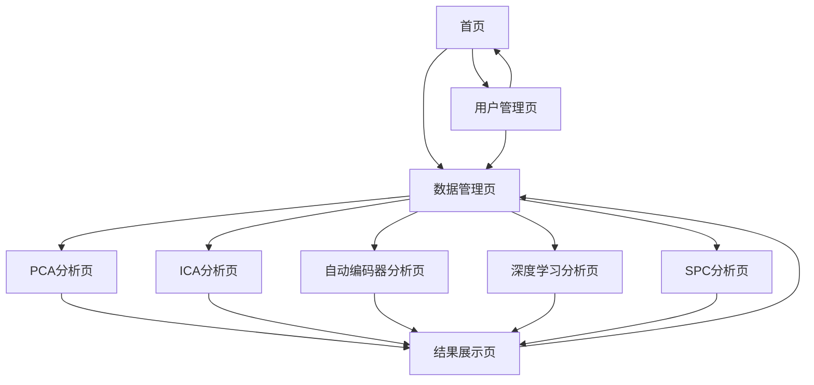

# 智能诊断系统Web版产品需求文档

## 1. Product Overview

智能诊断系统Web版是一个专业的工业过程监控与故障诊断平台，集成了PCA、ICA、自动编码器等多种先进的数据分析算法。

该系统旨在为工业生产提供实时监控、异常检测和故障诊断服务，帮助企业提高生产效率和产品质量。通过Web化改造，用户可以随时随地访问系统，无需安装客户端软件。

目标是打造一个现代化、易用性强的工业智能诊断平台，为制造业数字化转型提供技术支撑。

## 2. Core Features

### 2.1 User Roles

| Role | Registration Method | Core Permissions |
|------|---------------------|------------------|
| 管理组用户 | 管理员邀请注册 | 系统管理、用户管理、数据管理、所有分析功能、系统配置、报告审核 |
| 使用组用户 | 邮箱注册或管理员创建 | 数据上传、数据分析、结果查看、报告生成（需管理组审核） |

### 2.2 Feature Module

我们的智能诊断系统Web版包含以下主要页面：

1. **首页**: 系统概览、快速导航、最近分析记录
2. **用户管理页**: 用户列表、权限管理、组织架构（仅管理组可见）
3. **数据管理页**: 数据上传、数据预览、数据筛选
4. **PCA分析页**: 主成分分析、监控图表、方差分析
5. **ICA分析页**: 独立成分分析、信号分离、异常检测
6. **自动编码器分析页**: 自动编码器模型训练、重构误差分析
7. **深度学习分析页**: 深度神经网络模型、高级机器学习算法
8. **SPC分析页**: 统计过程控制、控制图分析、过程能力评估
9. **结果展示页**: 分析结果可视化、报告生成、数据导出

### 2.3 Page Details

| Page Name | Module Name | Feature description |
|-----------|-------------|---------------------|
| 首页 | 系统概览 | 显示系统功能介绍、分析算法说明、使用指南 |
| 首页 | 快速导航 | 提供各分析模块的快速入口按钮 |
| 首页 | 最近记录 | 展示最近的分析历史和结果摘要 |
| 用户管理页 | 用户列表 | 显示所有用户信息、状态管理、搜索筛选（仅管理组） |
| 用户管理页 | 权限管理 | 用户角色分配、权限设置、批量操作（仅管理组） |
| 用户管理页 | 组织架构 | 部门管理、用户分组、层级关系设置（仅管理组） |
| 数据管理页 | 文件上传 | 支持Excel文件上传、数据格式验证、进度显示 |
| 数据管理页 | 数据预览 | 显示数据表格、基本统计信息、数据质量检查 |
| 数据管理页 | 数据筛选 | 按日期、车间等条件筛选数据 |
| PCA分析页 | 参数设置 | 设置主成分数量、是否移除异常值等参数 |
| PCA分析页 | 模型训练 | 执行PCA算法、显示训练进度、计算统计量 |
| PCA分析页 | 结果展示 | T²和SPE监控图、累积方差图、投影图 |
| ICA分析页 | 算法配置 | 设置独立成分数量、收敛参数 |
| ICA分析页 | 信号分离 | 执行ICA算法、计算I²统计量、异常检测 |
| ICA分析页 | 贡献分析 | 显示异常点贡献图、变量重要性排序 |
| 自动编码器分析页 | 网络结构 | 设置编码器维度、训练参数 |
| 自动编码器分析页 | 模型训练 | 深度学习模型训练、损失函数可视化 |
| 自动编码器分析页 | 异常检测 | RE²和SPE统计量计算、控制限设定 |
| 深度学习分析页 | 算法配置 | 设置神经网络结构、训练参数 |
| 深度学习分析页 | 模型训练 | 深度神经网络模型训练、序列数据分析 |
| 深度学习分析页 | 智能预测 | Transformer等模型应用、智能预测和分类 |
| SPC分析页 | 控制图设置 | 选择控制图类型（X-R、X-S、单值控制图）、设置控制限 |
| SPC分析页 | 过程监控 | 实时过程监控、异常点检测、趋势分析 |
| SPC分析页 | 能力分析 | 过程能力指数计算、规格限设定、能力评估报告 |
| 结果展示页 | 图表展示 | 交互式图表、多种可视化类型 |
| 结果展示页 | 报告生成 | 自动生成分析报告、支持PDF导出 |
| 结果展示页 | 数据导出 | 导出分析结果、统计数据 |

## 3. Core Process

**管理组用户流程：**
1. 管理员登录系统，进行用户管理和系统配置
2. 创建和管理使用组用户账户，分配权限
3. 监控系统使用情况，审核分析报告
4. 执行所有数据分析功能，管理数据资源

**使用组用户流程：**
1. 用户登录系统，访问系统首页了解功能
2. 进入数据管理页面，上传Excel格式的工业数据文件
3. 系统自动进行数据预处理和质量检查
4. 选择合适的分析算法（PCA、ICA或自动编码器）
5. 设置分析参数，启动模型训练和分析过程
6. 查看分析结果，包括各种监控图表和统计指标
7. 生成分析报告，提交给管理组审核后导出

## 4. User Interface Design

### 4.1 Design Style

- **主色调**: 深空蓝 (#f0f0f0) 作为背景色，霓虹蓝 (#1890ff) 作为主题色
- **辅助色**: 电紫色 (#722ed1) 用于强调，浅灰色 (#333333) 用于文字
- **按钮样式**: 现代化圆角按钮，支持悬停和点击效果
- **字体**: 使用微软雅黑或系统默认无衬线字体，主要字号16px
- **布局风格**: 卡片式设计，顶部导航栏，响应式布局
- **图标风格**: 简洁的线性图标，支持SVG格式

### 4.2 Page Design Overview

| Page Name | Module Name | UI Elements |
|-----------|-------------|-------------|
| 首页 | 系统概览 | Hero区域，渐变背景，大标题，功能介绍卡片 |
| 首页 | 快速导航 | 网格布局的功能按钮，图标+文字，悬停效果 |
| 用户管理页 | 用户列表 | 数据表格，搜索框，筛选器，操作按钮组 |
| 用户管理页 | 权限管理 | 角色选择器，权限矩阵，批量操作工具栏 |
| 用户管理页 | 组织架构 | 树形结构，拖拽排序，层级展示 |
| 数据管理页 | 文件上传 | 拖拽上传区域，进度条，文件列表 |
| 数据管理页 | 数据预览 | 响应式表格，分页器，搜索框 |
| PCA分析页 | 参数设置 | 表单控件，滑块，开关按钮 |
| PCA分析页 | 结果展示 | 图表容器，选项卡切换，工具栏 |
| ICA分析页 | 信号分离 | 实时进度显示，状态指示器 |
| 自动编码器分析页 | 模型训练 | 训练日志，损失曲线图，停止按钮 |
| 结果展示页 | 图表展示 | 交互式图表库，缩放平移，图例控制 |

### 4.3 Responsiveness

系统采用桌面优先的响应式设计，支持移动端适配。在移动设备上，导航栏会折叠为汉堡菜单，图表会自动调整尺寸，表格支持横向滚动。考虑触摸交互优化，按钮和链接具有足够的点击区域。